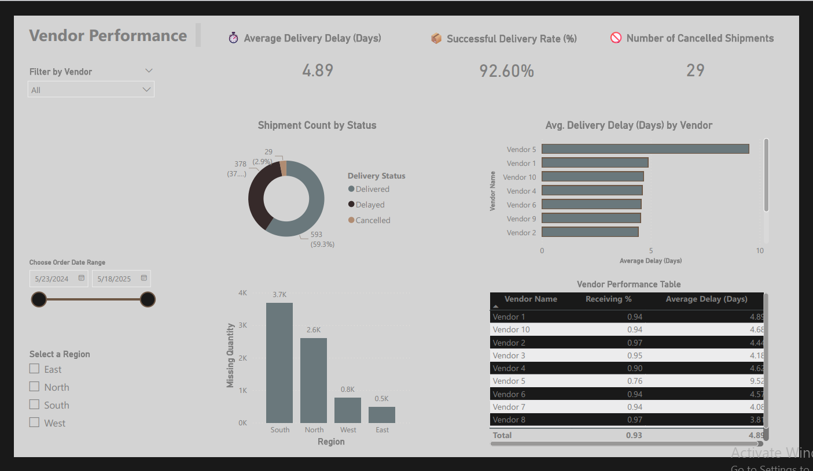

# 📦 Vendor Performance Dashboard – Power BI

## 📌 Overview
This Power BI dashboard provides a full analytical view of **vendor delivery performance**, helping organizations track delays, evaluate vendor reliability, and monitor shipment outcomes across regions and date ranges.

It supports decision-making in procurement, supply chain management, and vendor optimization.

---

## 🎯 Key Metrics

| Metric | Value |
|--------|--------|
| **Average Delivery Delay (Days)** | 4.89 |
| **Successful Delivery Rate (%)** | 92.60% |
| **Cancelled Shipments** | 29 |

These KPIs summarize vendor efficiency and overall delivery quality.

---

## 📊 Visual Insights

### 🥧 Shipment Count by Status
Shows distribution of:
- Delivered  
- Delayed  
- Cancelled  

### 📉 Avg. Delivery Delay (Days) by Vendor
Identifies:
- Fastest vendors  
- Vendors with repeated delay issues  
- Performance ranking  

### 🌍 Missing Quantity by Region
Compares shortage levels across:
- South  
- North  
- West  
- East  

### 📋 Vendor Performance Table
Includes:
- Vendor Name  
- Receiving %  
- Average Delay (Days)  

---

## 🧭 Filters (Slicers)
Users can interact with:
- Vendor filter  
- Date range slider  
- Region selector  

Enhances dynamic exploration of vendor performance.

---

## 🖼 Dashboard Preview

---

## 🛠 Tools Used
- Power BI Desktop  
- Power Query for data cleanup  
- DAX calculations  
- Data modeling  
- Interactive visuals & slicers  

---

## 📁 Files Included
- `Vendor_Performance.pbix`  
- `Vendor Performance.png`  
- `README.md`

---

## 🎯 Conclusion
This dashboard provides actionable insights into:
- Vendor reliability  
- Delivery performance  
- Shipment status  
- Regional supply chain issues  

It is a powerful tool for strategic procurement and supply chain optimization.
